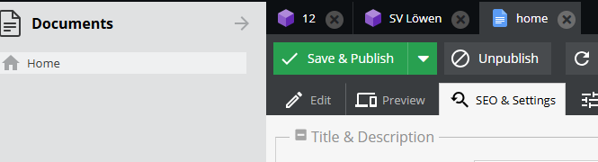
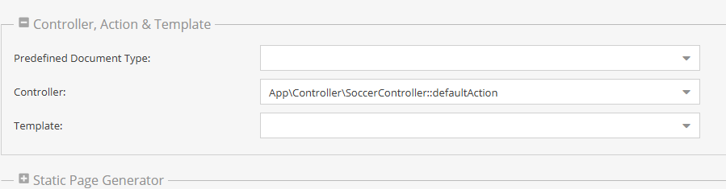

# Demo on Pimcore

## How to use the file
### Start the needed service with:  
`cd soccer_pimcore`  
`docker compose up -d`    
`docker compose exec php composer install`  
`docker compose exec php vendor/bin/pimcore-install --mysql-host-socket=db --mysql-username=pimcore --mysql-password=pimcore --mysql-database=pimcore`  
Select Options:  
 1. Select username
 2. Select password
 3. yes (to install Bundles)
 4. 5 (to install staticRoutesBundles)
 5. yes

### Setup Views:  
1. Login to the admin-view on:  
`localhost/admin/`
2. Go to Documents on Home-Screen -> "SEO & Settings"  
  

3. Select in "Controller,Action & Template", "Controller" -> `App\Controller\SoccerController::defaultAction`  

### Import Assets:
1. In Admin-view got to "Assets" right click on home select "Add Assets" -> "Upload Files" and import all images from [assets](public/var/assets) in that repo.
2. In Admin-view go to "Data Objects" right click on home select "Add Folder"  
<b>-> Label one Folder "Teams" and Label one Folder "Players"</b>  
3. There are two csv-Files holding Data of FootballTeams and Players.   
To import team:
`docker exec -it soccer_pimcore-supervisord-1 bin/console import:team`  
To import player:
`docker exec -it soccer_pimcore-supervisord-1 bin/console import:player`

## Rights
Links for Soccer Logos:
- team1 : https://commons.wikimedia.org/wiki/File:S%C3%BCdostdeutscher_Fu%C3%9Fball-Verband_-_Neues_Emblem.png 
- team2 : https://commons.wikimedia.org/wiki/File:Logo_SSV_Ulm.png
- team3 : https://commons.wikimedia.org/wiki/File:Fussball_Mannschaft_Frisch_Auf.png 
- team4 : https://commons.wikimedia.org/wiki/File:1FCGievenbeckLogo.svg 
- team5 : https://commons.wikimedia.org/wiki/File:Bayern_M%C3%BCnchen_Logo_(1901-1906).svg
- team6 : https://commons.wikimedia.org/wiki/File:Bayern_M%C3%BCnchen_Logo_(1901-1906).svg
- team7 : https://commons.wikimedia.org/wiki/File:T%C3%BCrkg%C3%BCc%C3%BC_M%C3%BCnchen_Logo.svg 
- team8 : https://commons.wikimedia.org/wiki/File:Freiburger_FC_Logo.svg
